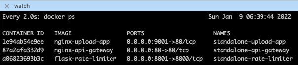
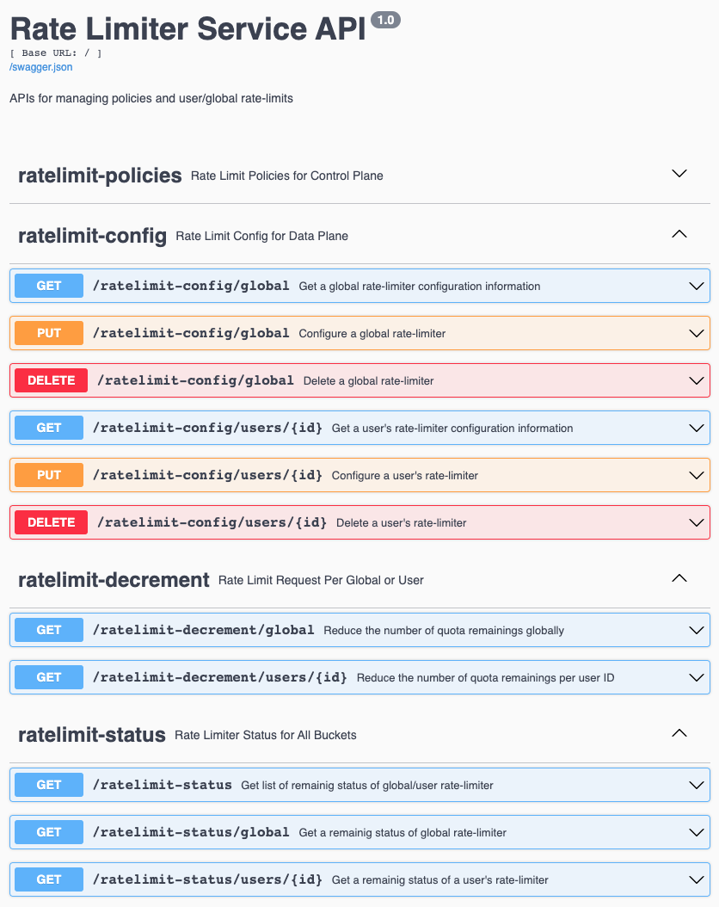
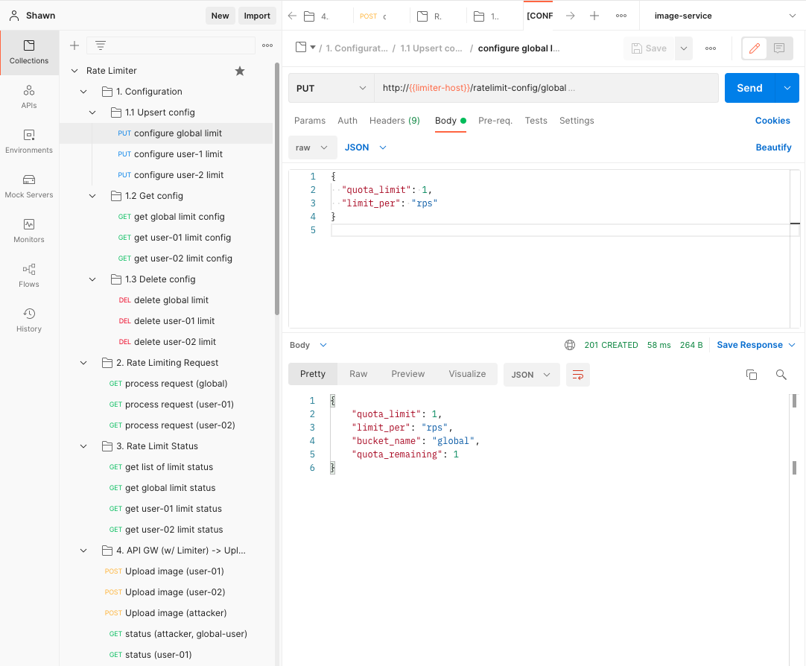

# Standalone Rate Limiter w/ API Gateway
The rate-limit allows you to limit the amount of HTTP requests a user can make in a given period of time.

This repo provides an example of standalone rate-limiter app that can be called by an API gateway. Given this way, developers do not need to implement rate-limit handling in each API endpoint of various apps. So you can only focus on developing business logic in your application.

```
                              +--------------+
                              | Rate Limiter |
                              +-------+------+           
                                      |             
          +-------------+             V           Yes    +---------------+ 
 User --> | API Gateway +-----> [ remaining > 0 ] -----> | Upload App    | 
      <-- |   (Nginx)   |       <- time-window ->        | (Backend API) | POST /images
      429 +-------------+             |                  +---------------+        :
                 A                 No |                                    GET  /api/xxx
                 |                    |
                 +--------------------+
                 429, too many requests
```

### Table of Contents
- [Getting Started](#getting-started)
- [How To Test](#how-to-test)
  - [Running Automated Test](#running-automated-test)
  - [Testing By Rate Limiter APIs](#rate-limiter-apis)
  - [Testing By Code](#code-example)
- [Directory Structure](#directory-structure)
- [Solution Summary](#solution-summary)
  - [Algorithm](#algorithm)
  - [Programming Languages](#programming-languages)
  - [Time & Space Analysis](#time-&-space-analysis)
- [Downsides and Improvements](#downsides-and-improvements)
  - [Multiple Rate Types per Each User](#multiple-rate-types-per-each-user)
  - [Allowing Burst of Adequate Size](#allowing-burst-of-adequate-size)
  - [Availability](#availability)
  - [Scalability](#scalability)
  - [Data Consistency](#data-consistency)
  - [Race Condition](#race-condition)
  - [Security](#security)
- [Distributed Rate Limiting Solution](#distributed-rate-limiting-solution)
- [Demo](#demo)
  - [Standalone Rate-Limiter](#standalone-rate-limiter)
  - [Distributed Rate-Limiter](#distributed-rate-limiter)

## Getting Started

**Prerequisites:**
- Install Python 3.x for unit and functional test.
- Install Docker and Docker Compose for integration, end-to-end (E2E) test.
- Install Golang for integration test.
- Add `127.0.0.1 host.docker.internal` into `/etc/hosts` file.

**Create and run Docker container images for `api-gateway`, `upload-app`, and `rate-limiter`:**
```bash
$ make start
``` 

**Check docker status if 3 containers are successfully run:**
```bash
$ make watch
``` 



## Running Automated Test
- `make unit-test`: Test each function in [`./services/rate-limiter/test/unit/*.py`](./services/rate-limiter/test/unit).
- `make functional-test`: Test Rate Limiter object in [`./services/rate-limiter/test/functional/*.py`](./services/rate-limiter/test/functional/).
- `make integration-test`: Test integrating with API GW, rate limiter app, and upload service app in `./services/rate-limiter/test/integration/*.go`
- `make e2e-test`: Automated end to end (E2E) test (TBD); [Manual E2E Test](./services/rate-limiter/test/end_to_end)
- `make test`: Run all of the above test phases.
- `Sample Test result`:
  - [Unit Test: Report Example](./services/rate-limiter/test/unit/test-result_sample.txt)
  - [Functional Test: Report Example](./services/rate-limiter/test/functional/test-result_sample.txt)
  - [Integration Test: Report Example](./services/rate-limiter/test/integration/test-result_sample.txt)
  > Node that assertions are not implemented in the functional and integration test. You could find several test cases there. Additional corner cases should be considered.
- `make down`: Kill Docker containers for 3 services of `api-gateway`, `upload-app`, and `rate-limiter`.
- `make clean`: Remove Docker container images and volumes.


## Testing By Rate Limiter APIs
After running docker containers, you could manually test the following test scenarios based on the Rate Limiter APIs via either your `web browser w/ Swagger` (`http://localhost`) or [Postman collections](./test/postman/rate_limiter.postman_collection.json).
- Configuring global and user limit.
- Requesting limit process via API Gateway to Rate Limiter.

> **Swagger Example:**
  

> **Postman Example:**
  

## Testing By Code
The following code is to show how to test the rate limiter, and how it functionally works. It can be one of rate limiter clients in your code. But, I recommend that you run the rate limiter app which can be called by API gateway instead of implementing this to every business logic for flexibility and maintenability of your code. So you could focus on implementing your business logic only.

```python
"""Sample Code For Rate Limiter

Processing Request Result Example:
-------------------------------------------------
   001. remaining: 3, 1641733112.402514 ,  True
   002. remaining: 2, 1641733112.402637 ,  True
   003. remaining: 1, 1641733112.402656 ,  True
   004. remaining: 0, 1641733112.402667 , False
        quota exhausted: request-004 is denied

   005. remaining: 3, 1641733113.404896 ,  True
   006. remaining: 2, 1641733113.405069 ,  True
   007. remaining: 1, 1641733113.405118 ,  True
   008. remaining: 0, 1641733113.405151 , False
        quota exhausted: request-008 is denied

   009. remaining: 3, 1641733114.4103858,  True
   010. remaining: 2, 1641733114.410569 ,  True
"""

from core.common.utils import str_time
from core.controller.rate_limiter import RateLimiter
from time import time, sleep


def sample_rate_limiter_test():
    """Sample code to test how the rate limiter works"""
    my_user_id = "your-user-id"
    quota_limit = 3

    # 1. Create a rate limiter, and configure a quota limit for a user
    rate_limiter = RateLimiter()
    rate_limiter.configure_limit(user_id=my_user_id, rps=quota_limit)

    # 2. Request a rate-limit process
    for i in range(10):

        # Get current remaining for the user
        req_time = str_time(time())
        remaining = rate_limiter.cur_remaining(my_user_id)

        # Request a rate-limit process for the user. Assume that you call this
        # before calling any API. This function is called by one of endpoints
        # in the Rate Limiter App so that it can be executed via API gateway.
        res = rate_limiter.process_request(my_user_id)
        print(f"{i+1:03}. remaining: {remaining}, {req_time:18s}, {res!s:>5}")

        # Check if the rate-limiter is exhausted for the user.
        if not res and rate_limiter.is_exhausted(my_user_id):
            print(f"     quota exhausted: request-{i+1:03} is denied\n")
            sleep(1)


if __name__ == "__main__":
    sample_rate_limiter_test()
```

## Directory Structure
```bash
│ 
├── Makefile                          // CLIs for Easy Setup & Testing
│ 
├── docker                            // Dockerfiles for 3 services
│   ├── api-gateway
│   ├── rate-limiter
│   └── upload-app
├── docker-compose.yml
│ 
└── services
    ├── api-gateway                   // API Gateway, Rate Limiter Client
    │   ├── conf.d                    // - Proxied to rate-limiter, upload-app
    │   └── nginx.conf                // - Main nginx configuration
    │
    ├── rate-limiter                  // Rate Limiter App
    │   ├── app                       // - App entry point (API server)
    │   ├── core                      // - Core business logic
    │   │   ├── apis                  //   + API business logic
    │   │   │   ├── open_api.json     //     - Open API Schema
    │   │   │   └── *.py              //     - Business logic
    │   │   ├── common                //   + Common functions/constants
    │   │   ├── models                //   + APi request/response model
    │   │   └── controller            //   + Rate Limiter controller for quota mgmt.
    │   │       ├── bucket.py         //     - Token bucket algorithm
    │   │       ├── rate_limiter.py   //     - Main logic to manage buckets
    │   │       └── sliding_window.py //     - Sliding window counter (TBD)
    │   └── test
    │       ├── functional            // Functional test codes + script
    │       ├── integration           // Integration test codes + script
    │       ├── postman               // Postman collections for testing 3 services
    │       └── unit                  // Unit test cases based on pytest
    │
    └── upload-app                    // Upload Service App
        ├── conf.d                    // - Fake API request/response using nginx
        └── nginx.conf                // - Main nginx configuration
```

## Solution Summary

### Algorithm
This repo's Rate Limiter uses `token bucket algorithm` based on the following sliding time window.

```
                                   +--------+-----+------------------+   +---------+
                                   | ---->  sliding time-window -----------------> |
          +------------------------+--------+-----+------------------+   +---------+
          | clock time (sec)       | 0.0 ~ 0.5 ~ 1.0      ~      2.0 |...| 59 ~ 60 |
          +------------------------+--------+-----+------------------+   +---------+
          | - # of requests        | 2      |  0  |         0        |   |    0    |
 +--------+------------------------+--------+-----+------------------+   +---------+
 |        | - quota-limit (rps)    | 5      |  5  |         5        |   |    5    |
 | token  | - time-allowance       | 0      |  0  |       1 ~ 2      |   |   60    |
 | bucket | - quota-remaining      | 3      |  3  |         3        |   |    5    |
 |        | - current remaining w/ | 3      |  3  | 5=min(5,3+5~10*5)|   |    5    |
 |        |   sliding time-window  |        |     |       f(x)       |   |         |
 +--------+------------------------+--------+-----+------------------+   +---------+
 current remaining, f(x) = min(quota-limit, quota-remaining + time-allowance * quota-limit)
```

> **Token Bucket**:
  - **Pros**: Easy to implement; Memory efficient; Allow traffic-burst for short periods.
  - **Cons**: Challenging to *tune parameters* (bucket-size & refill-rate).

> **Leaky Bucket**:
  - **Pros**: Similar to the token bucket algorithm except that requests are processed at a fixed rate.
  - **Cons**: A burst of traffic fills up the queue with old requests, and if they are not processed in time, *recent requests will be rate limited*.

> **Fixed Window Counter**:
  - **Pros**: Easy to implement; Memory efficient; Reset available quota at the end of time window.
  - **Cons**: Spike in traffic at the edges of a window could cause *more requests than the allowed quota* to go through.

> **Sliding Window Log**:
  - **Pros**: Very *accurage* by keeping *track of timestamps*.
  - **Cons**: Memory inefficient.

> **Sliding Window Counter**:
  - **Pros**: Hybrid approach(Fixed Window Counter + Sliding Window Log). Memory efficient. *Smooths out spikes* in traffic.
  - **Cons**: It is an approximation of the actual rate not-so-strict look back window.

### Programming Languages
The solutions have been implemented by 3 programming languages for those of you who prefer to use different languages. Each application is subject to change languages.

  | Category                                       | Language               |
  |------------------------------------------------|------------------------|
  | `Rate Limiter App, Unit Test, Functional Test` | `Python`               |
  | `Rate Limiter Client in API Gateway`           | `Node.JS`              |
  | `Integration Test`                             | `Golang`               |
  | `API Gateway, Upload Service App`              | `Nginx(C) directives`  |

### Time & Space Analysis

> **Assumption**
  - `# of global limiters: 1`
  - `# of users: N`
  - `0 <= N <= 500,000,000 (500M)`
  - `Size of bucket per a user: M = 20`
    ```
    - M = quota-limit(4) + time-window(4) + quota-remaining(4) + last-update-time(8)
    - 2 byte short integer is not considered in this example.
    ```
  - `Size of bucket key: K, 4(int) <= K <= 36(string based on IdP sub) per your decision` 
  - The `key` consists of only either `global` or `user-id`. `URI` or `IP` is not considered.
  - The limitation of `requests-per-sec (rps)` is set globally or per-user. (neither `URI` or `IP`)
  - If both are set, only the user's limit should be used.
  - The rate limiter runs only on `one machine` in `one process`.

> **Time Complexity**

  | Category       | Insert | Search | Update | Delete |
  |----------------|--------|--------|--------|--------|
  | `Average`      | `O(1)` | `O(1)` | `O(1)` | `O(1)` |
  | `Worst Case`   | `O(N)` | `O(N)` | `O(N)` | `O(N)` |

> **Space Complexity**
  - `Average: O(N)`
  - `Worst Case: O(N)`
  
> **Capacity Estimation**: `12GB ~ 28GB`
  - `# of total bucket value size: 10GB = 500M users * M`
  - `# of total bucket key   size: 2GB ~ 18GB = 500M users * K (4 ~ 36)`
  - Note that bucket class object can be separated between data and functions to reduce memory usage. Because the function pointers can be part of memory size per a bucket per a user.

## Downsides and Improvements
Let's talk about major downsides of this standalone-rate-limiter approach based on token bucket algorithm. In the meantime, let's discuss some of solutions how to improve them together as follows.

### Multiple Rate Types per Each User
  - **Use Case:** What if a user wants to limit not only `requests-per-second (rps)` for traffic control but also `requests-per-month (rpm)` for API monetization?
  - **Downside:** The rate-limiter only supports one bucket per one user-id as a key.
  - **Improvement:** 
    - `Option 1`. creating seperate rate-limiters. (e.g. [1] for mitigating DDoS atacks. [2] for managing quotas for monthly payment.
    - `Option 2`. creating two composit keys for buckets per a user. (e.g. key1: user-id, key2: type)

### Allowing Burst of Adequate Size
  - **Use Case:** What if a user wants to allow a burst of additional size rather than denying services if the traffic is only congested during some specific time?
    ```
    quota_limit: 50 / sec

    (1) As-Is

          time    00:00       00:01       00:02  ...  12:00       12:01
        +-----------+-----------+-----------+-----------+-----------+
        | requested |    100    |     0     |     0     |     50    |
        +-----------+-----------+-----------+-----------+-----------+
        | rejected  |     50    |     0     |     0     |      0    |
        | accepted  |     50    |     0     |     0     |      0    |
        +-----------+-----------+-----------+-----------+-----------+

    (2) To-Be

          time    00:00       00:01       00:02  ...  12:00       12:01
        +-----------+-----------+-----------+-----------+-----------+
        | requested |    100    |      0    |     0     |     50    |
        +-----------+-----------+-----------+-----------+-----------+
        | delayed   |     50    |      0    |     0     |      0    |
        | accepted  |     50    |     50    |     0     |     50    |
        +-----------+-----------+-----------+-----------+-----------+
    ```
  - **Downside:** The current rate-limiter does not support delay.
  - **Improvement:** 
    - `Option 1`. `retrying failed requests` when a client gets 429 response code.
    - `Option 2`. adding `delay_cnt` parameter. But, there would be challeging to tune the parameter. Additional memory is required.

### Availability
  - **Use Case:** What if the rate limiter `process is down`?
  - **Downside:** The rate-limiter can't be served.
  - **Improvement:** running multi processes (`active-slave, active-active, or 3 actives`) or containers (`K8s Pod`) in a machine.

### Scalability
  - **Use Case:** What if the `machine is down`, or it is `busy` to handle `500m users`?
  - **Downside:** It can cause late response and low system performance.
  - **Improvement:** 
    - `Option 1`. Passing a request to `proxied upstream servers` via `load balancer(s)`.
    - `Option 2`. `hybrid approach between multi processes` (to reduce network latency) and `Option 1`.

### Data Consistency
  - **Use Case:** What if rate-limiters are run on `distributed machines`?
  - **Downside:** Each user's `quata-remaning` can be different `per each machine`.
  - **Improvement:** 
    - Synchronizing local cache with remote centralized datastore.
    - What if local memory size is not enough? Using LRU cache and synching with datastore unless key doesn't exist.

### Race Condition
  - **Use Case:** Same data is available for multiple servers for a given user to read/write using mutex.
  - **Downside:** Latency issue to wait for locks release. (Rate Limiter <-> Network <-> Datastore)
  - **Improvement:** 
    - Relaxation to the system to allow some failure percentage to avoid remote cache/DB locks and resolve latency.
    - Updating cache from datastore using hybrid approach between event message and regularly query.

### Security
  - **Use Case:** What if user IDs are abused by attackers in the header or query params?
  - **Downside:** Uncountable buckets per anonymous ID can be generated.
  - **Improvement:** for security risk mitigation, using IdP to refresh tokens, and validate (1) it w/ JWK and (2) session before using rate-limiter.


## Distributed Rate Limiting Solution
This solution has been started implementing as a minimum viable product (MVP). The initial approach is to configure 1 global limit and 1 policy per a user. Let's discuss what changes we would need to make this into a distributed rate-limiting solution.

In addition to that, to consider not only mitigating DDoS attack but also API monetization as well as data analytics, we would need to refactor the design and code which supports multiple types per a global system and a user.

- **Tradeoffs:** Accuracy <-> Performance, Speed, User Experience
- **Strategy:** Performance! Latency! -> Allowing some of error of rate-limit. Trying to avoid lock.
- **Additional Services**: Load balancers, API gateways, cache, key/value datastore, Sync App(cache <-> datastore), IdP
- **Approach**:

  | **Layer**    | **Recommendation**                                                        |
  |--------------|---------------------------------------------------------------------------|
  | `Client`     | Frontend or API client: retry requests when getting 429 error.            |
  | `LB, API-GW` | Use echo system (e.g. NGINX), session/token validation, upstream servers. |
  | `IdP`        | Auth-Z/N: ID/access token(short expiration), refresh token, login/logout. |  
  | `Network`    | Reducing hops (3 -> 2 hops): UI <-> API (cache), cache <-> datastore.     |
  | `Process`    | Availability: active-standby, active-active, etc.; Limiter-App, Sync-App  |
  | `Cache`      | Use local cache; Event-driven or regular update cache from datastore.     |
  | `Server`     | LB: proxeing to multi upstream servers that runs limiter/sync processes.  |
  | `Datastore`  | Source of truth. Updated key/value regularly or by event from cache.      |

## Demo

### Standalone Rate-Limiter
- Environment: 1 API Gateway, 1 Rate-Limiter, 1 Fake Upload App
- How To Run Test Environment: [Click here](#getting-started)

### Distributed Rate-Limiter
- Environment: 1 Single Page App(SPA), 2 API Gateway(GW)s, 1 IdP, 2 Rate-Limiter(RL)s, 2 Fake Upload-App(UA)s, 2 Datastores, 2 Sync-Apps
  ```
  User(SPA)
    |            
    |        [SPA: Frontend]
    |            |                
    |            |                [RL in API-GW or different machine]
    |   [IdP]--+ |   .................................................    +----> [Sync-App 1..j]
    |          | |   :                                               :    |       1) Event
    |          | |   :            +- RL 1 --- Cache <-- Sync-App <-+ :    V       2) Regulary
  [LB ] --+- [API-GW 1] -+        |     :                          +-+-> [LB] -+ 
          |          :   +- [LB] -+- RL n --- Cache <-- Sync-App <-+ :         +- Datastore 1
          |          :   |                                           :         |            :
          |          :...+...........................................:         +- Datastore k
          |              |                                                        (Key/Value)
          |              +- [LB] -+- UA 1 (Fake Upload App)
          |              |        |     :    
          +- [API-GW m] -+        +- UA i 
               | |
        [SPA]--+ +-- [IdP]
  ```
- How To Run Test Environment: `TBD`

